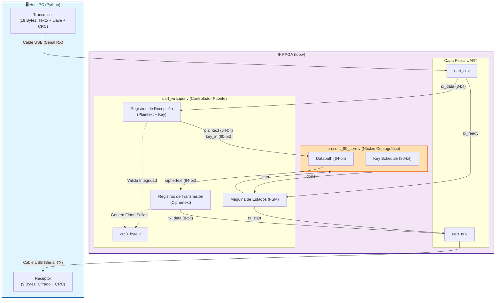
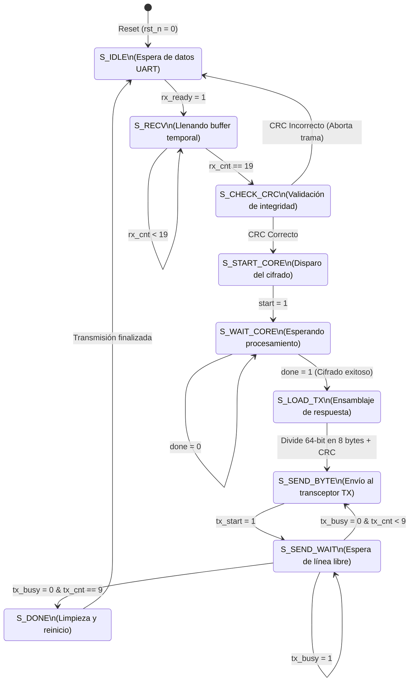

# digital_electronics_2026-1s
Verilog scripts for Digital Electronics I [Lab/Final Project] 2026-1S - Universidad Nacional de Colombia | Bogota
--

# Actividades
1. Bloque de seleccion de datos de la llave 
2. Bloque XOR datos/llave
3. Bloque de substitution-box
4. Bloque de creacion de llave
5. Iteracion
6. Entrada serial de datos
7. Salida serial de datos
8. Conexion con display
9. Testing
10. Entrega

