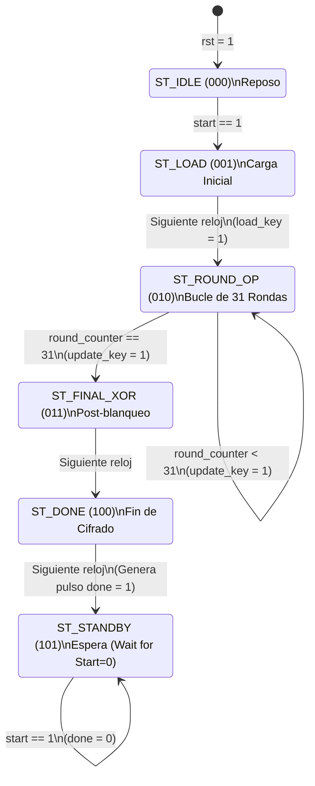

# Digital Electronics I - Final project
## Implementation of a lightweight cryptography algorithm for low-capacity IoT devices 

### FSM

```mermaid
stateDiagram-v2
    direction TB
    
    %% Definición de los nodos (Estados)
    state "ST_IDLE (000)\nReposo" as IDLE
    state "ST_LOAD (001)\nCarga Inicial" as LOAD
    state "ST_ROUND_OP (010)\nBucle de 31 Rondas" as ROUND_OP
    state "ST_FINAL_XOR (011)\nPost-blanqueo" as FINAL_XOR
    state "ST_DONE (100)\nFin de Cifrado" as DONE
    state "ST_STANDBY (101)\nEspera (Wait for Start=0)" as STANDBY

    %% Transiciones
    [*] --> IDLE : rst = 1
    
    IDLE --> LOAD : start == 1
    
    LOAD --> ROUND_OP : Siguiente reloj\n(load_key = 1)
    
    ROUND_OP --> ROUND_OP : round_counter < 31\n(update_key = 1)
    
    ROUND_OP --> FINAL_XOR : round_counter == 31\n(update_key = 1)
    
    FINAL_XOR --> DONE : Siguiente reloj
    
    DONE --> STANDBY : Siguiente reloj\n(Genera pulso done = 1)
    
    STANDBY --> STANDBY : start == 1\n(done = 0)
```
    
    STANDBY --> IDLE : start == 0
