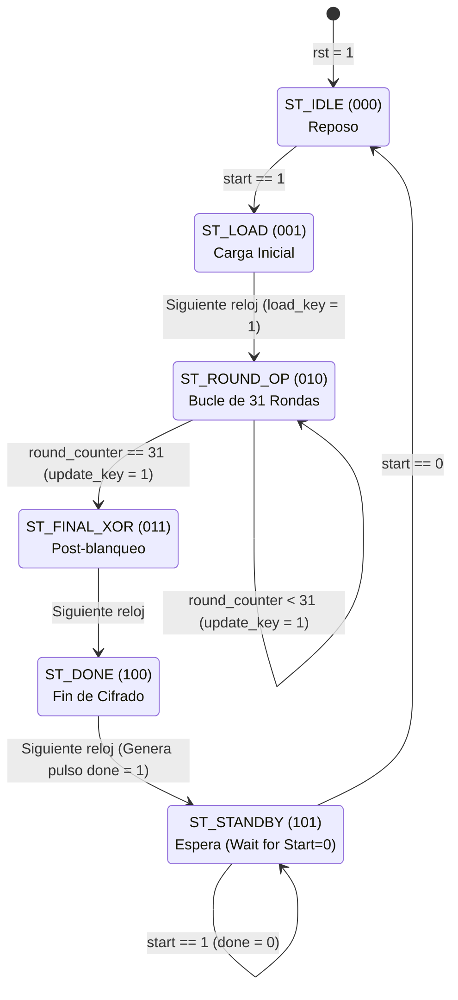

# Digital Electronics I - Final project
## Implementation of a lightweight cryptography algorithm for low-capacity IoT devices 

### FSM
The following diagram represents algorithm-flow using a finite state machine for PRESENT-80

> [!NOTE]
> Each step has its own functionality implement by the modules in this repo.
